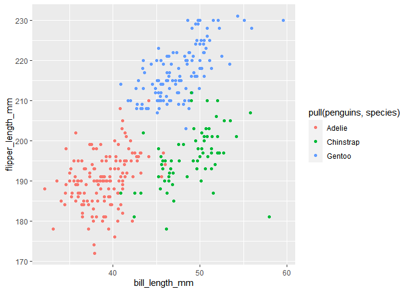

P8105_hw1_REN XIN
================
2022-09-23

``` r
library(tidyverse)
```

    ## ── Attaching packages ─────────────────────────────────────── tidyverse 1.3.2 ──
    ## ✔ ggplot2 3.3.6      ✔ purrr   0.3.4 
    ## ✔ tibble  3.1.8      ✔ dplyr   1.0.10
    ## ✔ tidyr   1.2.1      ✔ stringr 1.4.1 
    ## ✔ readr   2.1.2      ✔ forcats 0.5.2 
    ## ── Conflicts ────────────────────────────────────────── tidyverse_conflicts() ──
    ## ✖ dplyr::filter() masks stats::filter()
    ## ✖ dplyr::lag()    masks stats::lag()

Problem 1:

``` r
library(palmerpenguins)
data("penguins", package = "palmerpenguins")
```

``` r
penguins <- na.omit(penguins)
```

``` r
nrow(penguins)
```

    ## [1] 333

``` r
ncol(penguins)
```

    ## [1] 8

``` r
mean(pull(penguins,flipper_length_mm))
```

    ## [1] 200.967

description: 1. The data(penguins) has 344rows(one row of NA) and 8
columns. 2. The flipper length is 200.966967 3. The data including 8
columns, which are species, island,
bill_length_mm,bill_depth_mm,flipper_length_mm,body_mass_g, sex and
year.

``` r
scatterplot_df=
  tibble( 
    bill_length_mm = pull(penguins,bill_length_mm),
    flipper_length_mm = pull(penguins,flipper_length_mm)
  )
ggplot(scatterplot_df, aes(x= bill_length_mm,y= flipper_length_mm))+geom_point (aes(color=pull(penguins, species)))
```

<!-- -->

``` r
ggsave("scatterplot of p8105_hw1_RX.pdf")
```

    ## Saving 7 x 5 in image

Problem 2:

``` r
df=tibble(
   norm_nb = rnorm(10),
   norm_logical = norm_nb>0,
   norm_character = as.character(norm_nb),
   df_factor=factor(c("10","15","20","10","15","20","10","15","20","10"),levels = c("10","15","20"))
)
```

The norm_nb’s mean is 0.0457503 The norm_logical’s mean is 0.4 The
norm_character’s mean is NA The df_factor’s mean is NA

``` r
as.numeric(df$norm_character)
```

    ##  [1] -0.07065473  0.09280487 -0.49227235 -0.47407042 -0.59794716 -0.33828348
    ##  [7]  1.64652806  0.60704650  2.05757681 -1.97322509

``` r
as.numeric(df$df_factor)
```

    ##  [1] 1 2 3 1 2 3 1 2 3 1

Now,The norm_character’s mean is NA The df_factor’s mean is NA,So, The
norm_character’s mean is 0.0457503 The df_factor’s mean is 1.9
